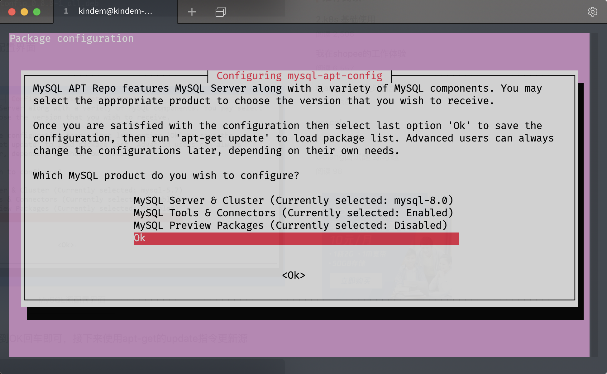

# 🧀 配置 apt-get Repo

首先打开网站 [MySQL APT Repo](https://dev.mysql.com/downloads/repo/apt/)，下载 `MySQL APT` 仓库描述文件：


右键 `No thanks, just start my download` 链接，选择复制链接：


进入服务器终端，进入工作目录：

```shell
cd ~
```

使用 `wget` 下载刚刚复制的 `deb` 文件链接：

```shell
wget https://dev.mysql.com/get/mysql-apt-config_0.8.15-1_all.deb
```

版本号可能不一定相同，以你自己复制的为准。下载完成后可以看到新增的文件，使用 `dpkg` 将仓库添加到 `apt-get` 中：

```shell
sudo dpkg -i ./mysql-apt-config_0.8.15-1_all.deb
```

过程中会弹窗：



选择最后一项继续，完成选择后再更新一把 `apt-get` 的源：

```shell
sudo apt-get update
```

完成后可以开始正式的安装了：

# 🍙 安装

```shell
sudo apt-get install mysql-server
```

中途会提示输入创建数据库 `root` 用户密码，创建后继续即可。

# 🍥 基本操作

开启服务：

```shell
sudo service mysql start
```

关闭服务：

```shell
sudo service mysql stop
```

重启服务：

```shell
sudo service mysql restart
```

登录：

```shell
mysql -u $username -p
```

# 🍖 创建其他账户

尽量不要直接使用 `root` 账户，登录数据库后使用如下指令创建用户：

```shell
mysql> CREATE USER 'username'@'%' IDENTIFIED BY 'password';
```

分配所有权限（也可按需分配）：

```shell
mysql> GRANT ALL PRIVILEGES ON *.* TO 'username'@'%';
```

刷新权限：

```shell
mysql> FLUSH PRIVILEGES;
```

修改 `bind-address`：

```shell
sudo vim /etc/mysql/mysql.conf.d/mysqlld.cnf
```

更改：

```shell
  # By default we only accept connections from localhost
- bind-address    = 127.0.0.1
+ bind-address    = 0.0.0.0
```

这样就可以远程登录 `MySQL` 了，生产环境记得改回来。
