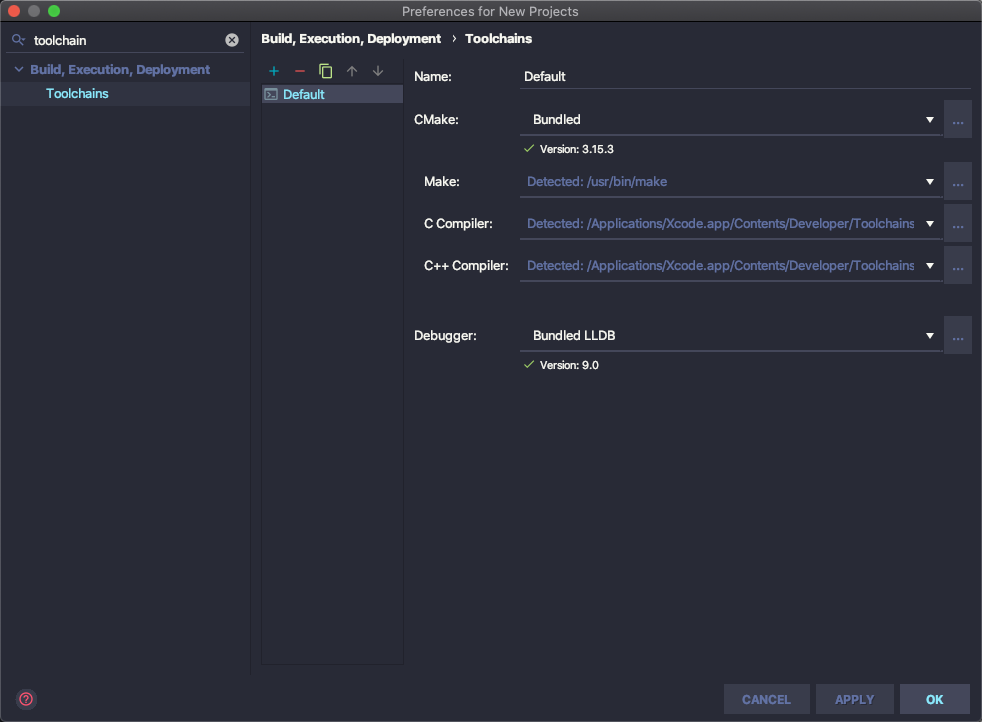
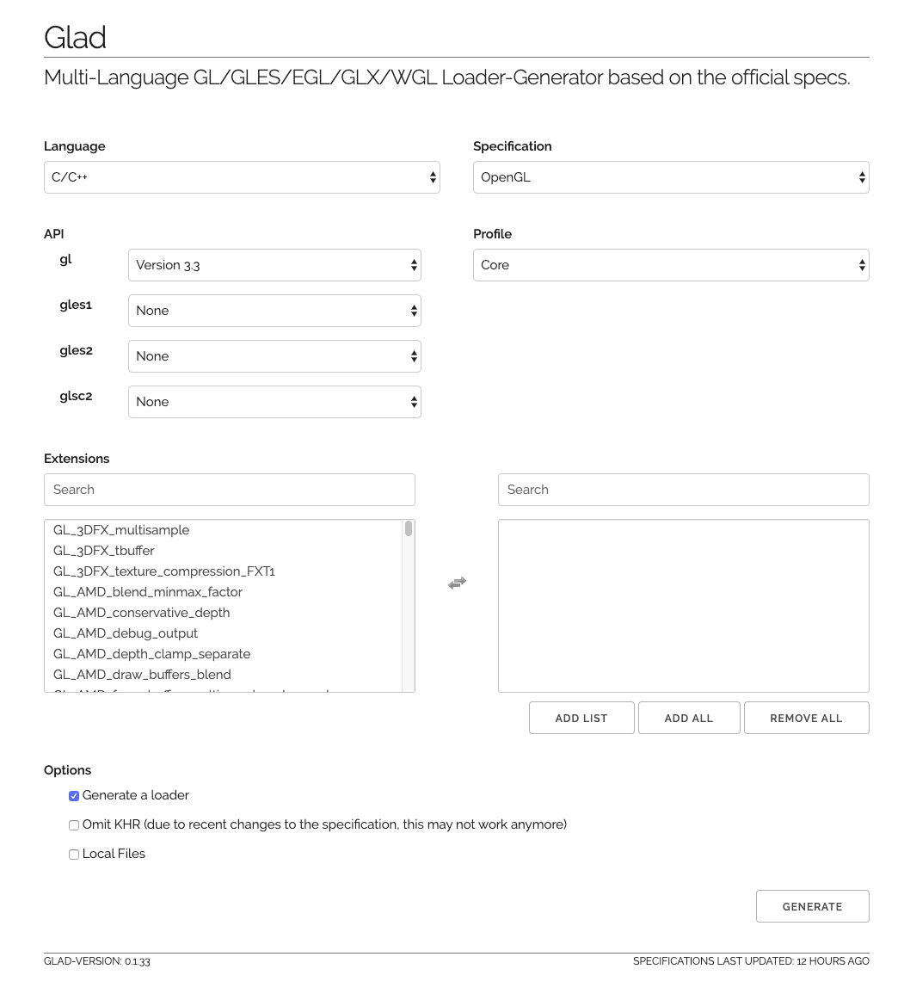
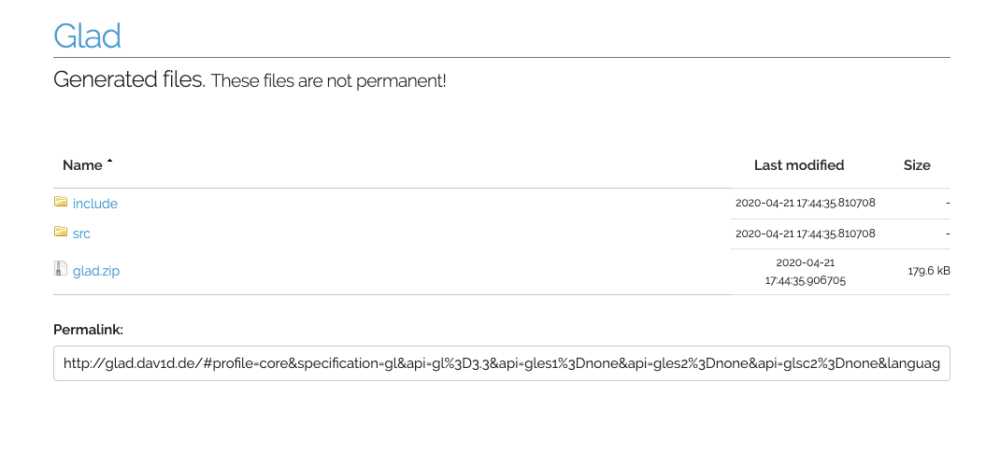

# 准备工作

首先确认自己的 `MacOS` 上已经安装了 `gcc`：

```shell
gcc --version
```

可以看到版本号：

```shell
kindem@JohndeMacBook-Pro ~ % gcc --version
Configured with: --prefix=/Applications/Xcode.app/Contents/Developer/usr --with-gxx-include-dir=/Applic
ations/Xcode.app/Contents/Developer/Platforms/MacOSX.platform/Developer/SDKs/MacOSX.sdk/usr/include/c++
/4.2.1
Apple clang version 11.0.3 (clang-1103.0.32.59)
Target: x86_64-apple-darwin19.3.0
Thread model: posix
InstalledDir: /Applications/Xcode.app/Contents/Developer/Toolchains/XcodeDefault.xctoolchain/usr/bin
kindem@JohndeMacBook-Pro ~ % 
```

如果没有安装的话会上面的指令会自动触发 `XCode` 下载并安装，根据提示安装完成之后再使用上面的指令检查一遍即可。

接着安装 `CLion`，个人是极其推荐使用 `JetBrain` 家的 `IDE` 进行开发的，可以在如下网站下载：[CLion - JetBrain](https://www.jetbrains.com/clion/)，下载完成后自行完成安装与激活即可。

安装完 `CLion` 之后，可以在 `Settings` 中检查 `Toolchain` 是否正确识别，如下：



通常来说只需要安装好 `gcc` 即可，因为 `cmake` 会在 `CLion` 中自带，而 `make` 会在 `MacOS` 系统中提供。

# 下载依赖库

通常来说，搭建 `OpenGL` 的开发环境需要两剑客：

* `GLFW`: 提供跨平台的 `OpenGL` 上下文初始化与窗口创建等功能
* `GLAD`: 提供跨平台的 `OpenGL` 函数指针加载等功能

我们按照顺序分别下载这些库，首先是 `GLFW`，地址在这：[Download - GLFW](https://www.glfw.org/download.html)，`GLFW` 在不同的平台上都有预编译好的包，我们根据我们的系统下载 `MacOS` 版本的预编译包：


接下来是 `GLAD` 的下载与配置，`GLAD` 作为一个加载器，根据不同的系统与 `OpenGL`，库本身都有所变化，需要灵活配置，官方提供了一个在线配置与生成库的网站：[GLAD Config](http://glad.dav1d.de/)，我们根据我们的需要进行选择：



按照上面的图配置就行，这里的 `gl` 版本不一定要 `3.3`，我们可以根据我们的需要进行配置，完成配置之后点击 `generate`，可以看到：



下载图中的 `glad.zip` 即可。

将下载的 `GLFW` 和 `GLAD` 库分别解压出来并重命名，放到某个固定的目录，比如我放在 `~/Lib`，接下来配置两条环境变量：

```shell
export GLFW_HOME="/Users/kindem/Lib/GLFW"
export GLAD_HOME="/Users/kindem/Lib/GLAD"
```

推荐将这两条命令写入 `~/.bash_profile`，然后使用指令刷新环境变量：

```shell
source ~/.bash_profile
```

自此库的下载的配置就完成了。

# 创建与配置项目

首先使用 `CLion` 创建一个 `C/C++` 工程，创建完成之后应该可以看到项目根目录下有一个 `CMakeLists.txt` 文件，这时候我们可以按照如下配置修改：

```cmake
cmake_minimum_required(VERSION 3.15)
project(gl_playground)

set(CMAKE_CXX_STANDARD 11)

# 检查环境变量
if (NOT DEFINED ENV{GLFW_HOME})
    message(FATAL_ERROR "found no env named GLFW_HOME")
endif()
if (NOT DEFINED ENV{GLAD_HOME})
    message(FATAL_ERROR "found no env named GLAD_HOME")
endif()

# 暂存环境变量
set(GLFW_HOME $ENV{GLFW_HOME})
set(GLAD_HOME $ENV{GLAD_HOME})

# 设置头文件目录
include_directories("${GLFW_HOME}/include")
include_directories("${GLAD_HOME}/include")

# 添加 GLFW3 预编译库
add_library(glfw SHARED IMPORTED)
SET_TARGET_PROPERTIES(glfw PROPERTIES IMPORTED_LOCATION "${GLFW_HOME}/lib-macos/libglfw.3.dylib")

# 编译 GLAD 库
add_library(glad SHARED "${GLAD_HOME}/src/glad.c")

# 创建可执行文件
add_executable(gl_playground main.cpp)

# 链接 GLFW GLAD OpenGL
target_link_libraries(gl_playground glfw glad "-framework OpenGL")
```

编写完 `CMakeLists.txt` 之后，点击右上角的 `Reload Changes`，可以看见成功配置。

# 编写测试代码

完成项目配置后，改写 `main.cpp` 来写一个测试小程序吧：

```cpp
#include <iostream>
#include <glad/glad.h>
#include <GLFW/glfw3.h>

#define WINDOW_WIDTH 800
#define WINDOW_HEIGHT 600
#define WINDOW_TITLE "gl-playground"

void init();
void draw_frame();
void on_input(GLFWwindow* window);
void framebuffer_size_callback(GLFWwindow* window, int width, int height);

int main()
{
    glfwInit();
    glfwWindowHint(GLFW_CONTEXT_VERSION_MAJOR, 3);
    glfwWindowHint(GLFW_CONTEXT_VERSION_MINOR, 3);
    glfwWindowHint(GLFW_OPENGL_PROFILE, GLFW_OPENGL_CORE_PROFILE);
    glfwWindowHint(GLFW_OPENGL_FORWARD_COMPAT, GL_TRUE);

    GLFWwindow* window = glfwCreateWindow(WINDOW_WIDTH, WINDOW_HEIGHT, WINDOW_TITLE, nullptr, nullptr);
    if (window == nullptr) {
        std::cout << "failed to create GLFW window" << std::endl;
        glfwTerminate();
        return -1;
    }
    glfwMakeContextCurrent(window);
    if (!gladLoadGLLoader((GLADloadproc) glfwGetProcAddress)) {
        std::cout << "failed to initialize GLAD" << std::endl;
        glfwTerminate();
        return -1;
    }
    glViewport(0, 0, WINDOW_WIDTH, WINDOW_HEIGHT);
    glfwSetFramebufferSizeCallback(window, framebuffer_size_callback);

    init();
    while (!glfwWindowShouldClose(window)) {
        on_input(window);
        draw_frame();
        glfwSwapBuffers(window);
        glfwPollEvents();
    }

    glfwTerminate();
    return 0;
}

void init()
{

}

void draw_frame()
{
    glClearColor(.2f, .3f, .3f, 1.f);
    glClear(GL_COLOR_BUFFER_BIT);
}

void on_input(GLFWwindow* window)
{
    if (glfwGetKey(window, GLFW_KEY_ESCAPE) == GLFW_PRESS) {
        glfwSetWindowShouldClose(window, true);
    }
}

void framebuffer_size_callback(GLFWwindow* window, int width, int height)
{
    glViewport(0, 0, width, height);
}
```

点击 `CLion` 右上角的编译与运行，如果看到：


恭喜，到这里就成功啦！

# Tips

可以直接 `clone` 这个仓库，来获取作者的示例工程：[gl-macos-playground](https://github.com/FlyAndNotDown/gl-macos-playground)，另外推荐一个学习 `OpenGL` 的网站：[LearnOpenGL CN](https://learnopengl-cn.github.io)
