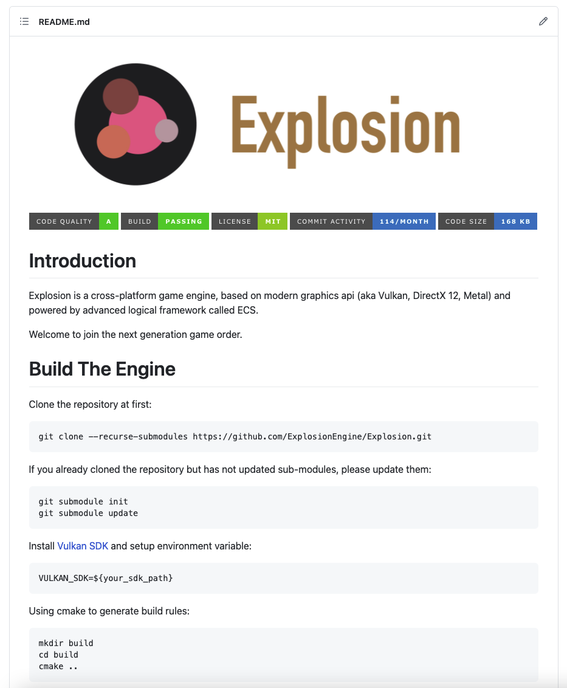
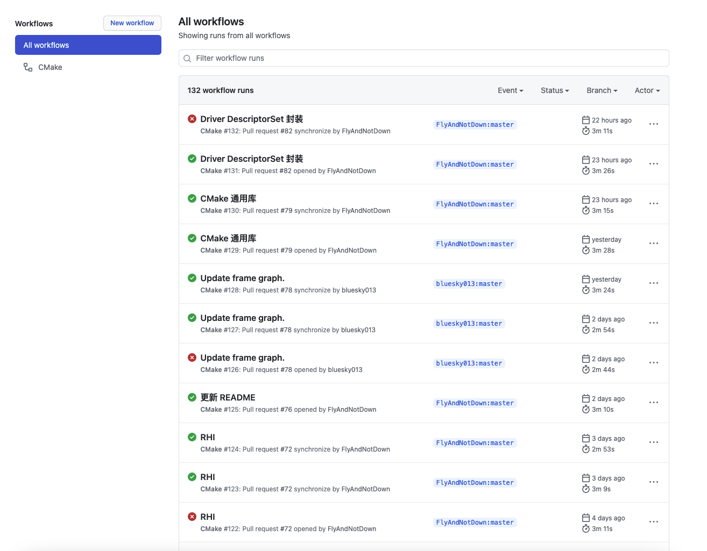
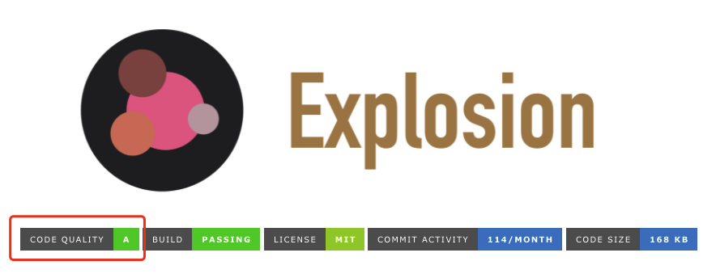

# 进展概览

## Repo 建设

先说说最近的进展吧，首先是 Repo 方面的建设，README 先写起来占坑了，顺便随手自己画了张 logo 图上丢上去占坑，可以简单看看现在的 README：



回头还需要把中文版的 README 和其他的细节慢慢补起来，不过我们现在真没太多人力投入这块，要做的东西太多了，之后把引擎本身完善的差不多了之后再慢慢弄吧。

## 工程管理

我们在团队内推崇大家使用 Issues 来交流、跟踪进展，使用 Project 来管理整个项目，大概效果是这样：


提交 Issues 会自动关联到 Project，MR 中需要关联对应的 Issues，在 MR 关闭时，Issues 会自动跟随 MR 关闭，并移动到 Project 的 Done 一栏，这样我们就能方便地跟踪需求和进展。

## CI

CI 方面我们目前使用的是 [GitHub Actions](https://docs.github.com/cn/actions)，不得不说这玩意可塑性要比其他的 CI/CD 工具强很多，写起来也是比较方便的，目前 CI 就配置了一个 cmake 构建，覆盖平台有：

* Ubuntu
* Windows

具体的代码在这：[Actions Code](https://github.com/ExplosionEngine/Explosion/tree/master/.github/workflows)，提交 MR 后自动触发，构建结果可以在 [Actions](https://github.com/ExplosionEngine/Explosion/actions) 查询：



构建通过是合入的硬性指标。其实我在纠结 MacOS 要不要加，因为实际上从构建来说，MacOS 的编译器和 GCC 还是比较一致的，一般不会出什么大岔子，后面再说吧。

## 构建系统优化

我抽空对所有的 CMake 进行了一次重构，主要做的事情是把常用的一些基本 CMake 指令做了一次封装，主要涉及：

* add_executable
* add_library
* add_test

我把他们封装成了：

* exp_add_executable
* exp_add_library
* exp_add_test

其实做的事情很简单，就是在原有指令的基础上，把头文件目录、链接库这类必备的操作与其合并了，用起来会更好用些，下面是一段示例：

```cmake
exp_add_executable(
    NAME ${TARGET_NAME}
    SRCS ${TARGET_SOURCES}
    INC_DIRS ${TARGET_INCLUDE_DIRS}
    LIBS ${TARGET_LIBS}
)

exp_add_library(
    NAME ${TARGET_NAME}
    TYPE ${TARGET_TYPE}
    SRCS ${TARGET_SOURCES}
    PRIVATE_INC_DIRS ${TARGET_PRIVATE_INCLUDE_DIRS}
    PUBLIC_INC_DIRS ${TARGET_PUBLIC_INCLUDE_DIRS}
    LIB ${TARGET_LIBS}
)

exp_add_test(
    NAME ${TARGET_NAME}
    WORKING_DIR ${TARGET_WORKING_DIR}
    SRCS ${TARGET_SOURCES}
    INC_DIRS ${TARGET_INCLUDE_DIRS}
    LIB ${TARGET_LIBS}
)
```

目的就是统一大家写 CMake 的风格。

## 代码质量控制

经过一番考量，我暂时选用了 [Codacy](https://www.codacy.com/) 作为我们的静态检查工具，因为是纯在线的工具，完全不需要集成，只需要按步骤启用 GitHub App 即可启用扫描，可以在 [Codacy Dashboard - Explosion](https://app.codacy.com/gh/ExplosionEngine/Explosion/dashboard) 找到静态扫描结果：


主干的代码提交以及 MR 会自动触发静态扫描，之后评级会自动刷新，然后同步到 README 的 Badge 中：



至于代码风格、安全问题、圈复杂度、重复率的扫描要不要整合到 CI 中，之后再考虑吧，现在来说已经够用了。。；÷

## RHI 重构

最近投入 Explosion 的时间并不是很多，RHI 重构算是最近的主要进展了，我之前写过一篇文章叫做 [醒醒吧，静态多态根本没有这么香](../39)，其实主要纠结的地方在于要不要追求极限性能，把 RHI 的主要架子完全用模板实现，但我最后还是放弃了。

模板在大型的架构设计与代码量级下会带来很多负面影响，主要会直接影响到接口的设计，虽然性能高，但我最后还是决定使用传统的 OOP 来完成 RHI 的编写。

抛开这些，我总算是决定先把 VulkanDriver 拆分出来了，抽象了一套公共的 Driver 接口，用于以后实现 DX12 和 Metal 后端，我很庆幸先做了这件事，不然后面改起来估计更蛋疼。

RHI 要走的路还很长，不过我打算小步快跑，先用 VulkanDriver 顶着，慢慢把上面的代码也写起来，让其他团队成员也能快速地参与进来。

## RPI / FrameGraph

RPI / FrameGraph 主要由 [bluesky013](https://github.com/bluesky013) 操刀，思路主要参考 GDC 2017 寒霜引擎的一次 Talk，可以在 [GDC Vault - FrameGraph](https://www.gdcvault.com/play/1024612/FrameGraph-Extensible-Rendering-Architecture-in) 找到这次 Talk 的 PPT。

我们设计的蓝本就是这个 Talk，目前逻辑差不多写完了，不过 AsyncComputePass 和 TransitionResources 处理上还有点小问题。

# 思考

## RHI 到底是个什么角色

## 通用渲染管线初步

## ECS 与脚本系统初步

## 插件系统初步

