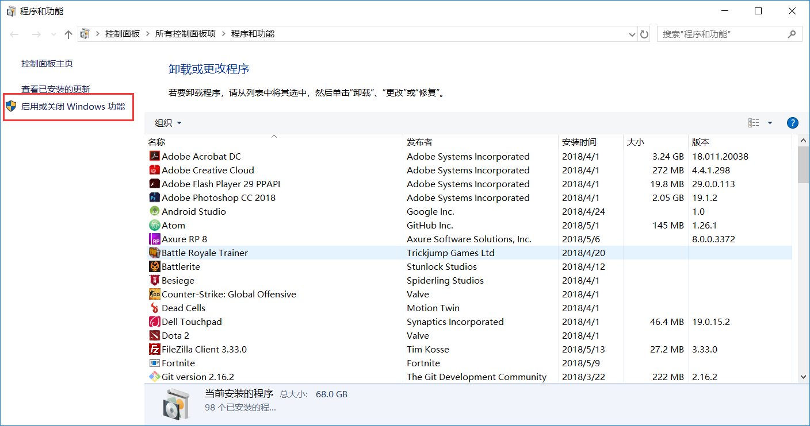
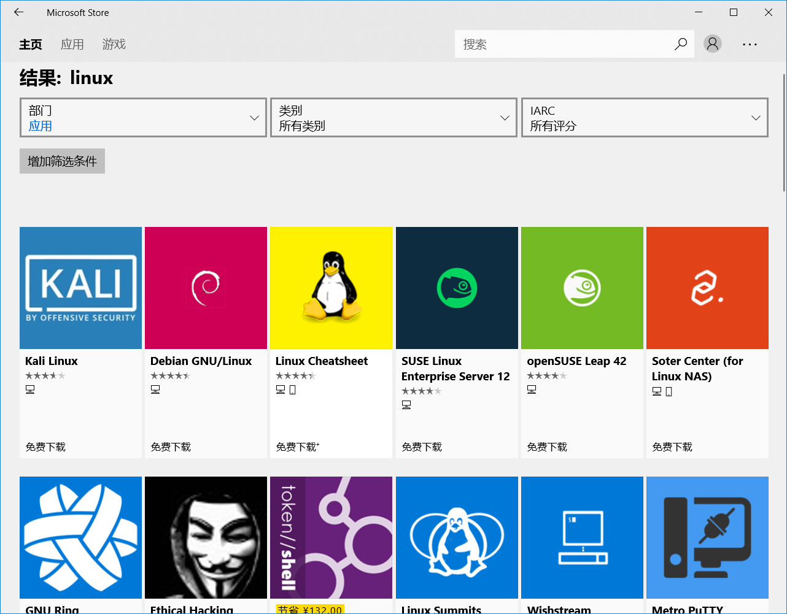

# 🤔 什么是 Bash On Windows
`Bash On Windows` 是微软的 `Microsoft Love Linux` 计划中重要的一环，目的是能让 `Windows` 用户能在系统中运行 `Linux` 子系统，也就是说你可以直接在 `Windows` 中获得原生 `Linux Bash` 级别的体验。

# 📦 安装
首先你要确保你的 `Windows` 已经升级到创意者更新版本( `1709` )，因为只有创意者更新版本以后的 `Windows`，`Bash On Windows` 才真正发行，之前的都是测试版本。

首先，你需要进入控制面板的程序与功能界面，点击启动或关闭 `Windows` 功能：


然后，把适用于 `Windows` 的 `Linux` 子系统这一项勾上，并且点击确定


接着，你就可以直接在商店下载你需要的 `Linux` 系统了，打开 `Windows Store`，搜索 `Linux`，可以看到很多 `Linux` 子系统：


你可以任选一下载，我选的是 `Ubuntu 18.04`，下载完成之后，你可以在 `Windows` 任务栏上面的搜索栏直接搜索 `Ubuntu` (我是 `Ubuntu`，如果你下了其他的你就搜其他的)，打开会要求你先重启电脑。

重启之，重启完成之后，再次打开子系统，你会发现他在慢慢解压，如果不成功的话，你可以直接在 `Windows Store` 中卸载它并且重新安装就行了，`Linux` 子系统在 `Windows` 里面，就相当于一个 `Windows Store` 应用。

安装完成之后，你就可以像使用普通 `Bash` 一样使用之了。

# ☕ 优化
当然，子系统是以 `cmd` 的形式跑在 `Windows` 里面的，这样显然会有很多问题，比如每次你退格所有字符，就会发出一声让人绝望的 `Windows` 错误提示音，再者这样的 `Linux Bash` 也不好看。

这里推荐使用 `cmder` 优化之，`cmder` 是一个优化版的 `Windows Cmd`，但是他可以设置启动命令，我们使用这条启动命令，可以让 `Cmd` 自动启动 `Bash`，这样就可以让 `cmder` 直接运行 `Bash`。

`cmder` 的字体和各种配置是可以设置的，所以，这样用子系统就很舒服！

cmder的官网在这：
[Cmder | Console Emulator](http://cmder.net/)

你可以下载 `Mini` 版，也可以下载 `Full` 版本，都差不多，运行 `cmder` 之后点击右下角的汉堡形按钮，可以看到 `Settings`，进去，像下面这样改动：


代码如下：
```
%windir%\system32\bash.exe ~ -cur_console:p:n
```

这样就可以让他启动的时候自动进入 `Bash`，另外字体什么的就不提了，可以在上面设置，配色什么的也是。

最后放一张我的Ubuntu子系统优化结果：


